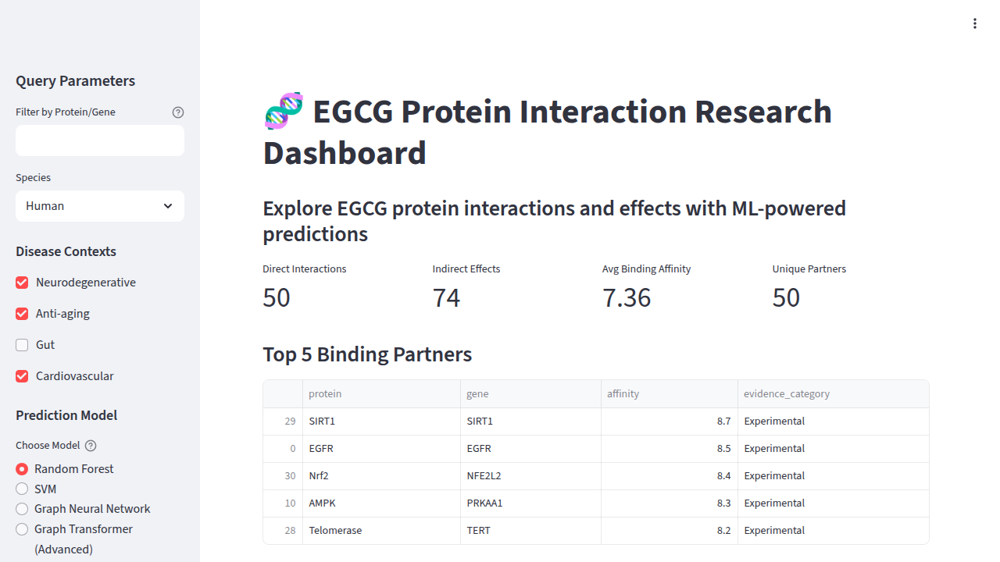
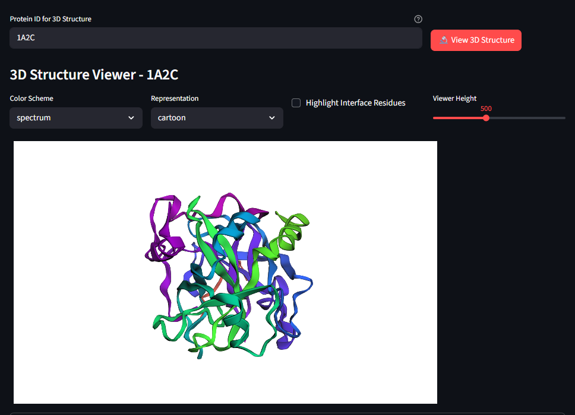
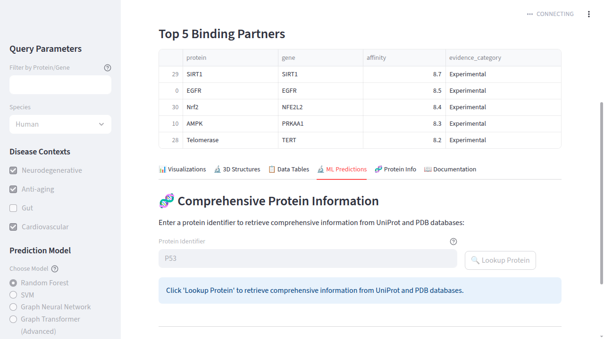

# 🧬 EGCG Protein Interaction Research Dashboard

A comprehensive Streamlit-based web application designed for researchers to query, visualize, and predict protein interactions with a focus on EGCG (Epigallocatechin gallate) compounds. This dashboard integrates machine learning capabilities with real-time data from multiple protein databases to provide insights into protein-protein interactions.

## 📸 Screenshots

### Homepage


### 3D Protein Structures


### Machine Learning Predictions


## 🚀 Features

### 📊 Data Visualization & Analysis
- Interactive charts and graphs for protein interaction data
- Support for filtering by species, disease context, and protein identifiers
- Visualization of binding affinities and evidence categories
- Comparative analysis of direct vs indirect protein effects


### 🔬 3D Protein Structure Viewer
- Interactive 3D visualization of protein structures from PDB and AlphaFold databases
- Individual protein structure viewing with rotation and zoom capabilities
- Side-by-side structure comparison for protein pairs
- Integration with both experimental (PDB) and predicted (AlphaFold) structures


### 🧠 Machine Learning Predictions
- Advanced ML models for predicting protein-protein interactions
- Support for multiple algorithms: Random Forest, SVM, Graph Neural Networks (GNNs)
- Batch prediction capabilities for multiple protein pairs
- Interface residue prediction for interaction sites
- Confidence scoring and model explanations


### 🧬 Comprehensive Protein Information
- Real-time protein sequence retrieval from UniProt
- Detailed protein metadata including molecular weight, isoelectric point
- Gene name mapping and protein family information
- Integration with multiple protein databases


### 📋 Data Management
- Built-in data tables for direct and indirect protein interactions
- CSV data import/export capabilities
- Data validation and error handling
- Support for custom datasets


## 🗄️ Data Sources

### Internal Datasets
- **EGCG_Direct_Interactions.csv**: Direct protein-protein binding interactions
  - Contains: protein, gene, interaction_type, affinity, evidence_category, species, disease_context
- **EGCG_Indirect_Effects.csv**: Indirect protein effects and regulatory interactions
  - Contains: protein, gene, effect_type, magnitude, evidence_category, species, disease_context

### External APIs & Databases

#### UniProt REST API
- **Primary endpoint**: `https://rest.uniprot.org/uniprotkb/{protein_id}.fasta`
- **Search endpoint**: `https://rest.uniprot.org/uniprotkb/search?query={protein_id}`
- **Metadata endpoint**: `https://rest.uniprot.org/uniprotkb/{protein_id}.json`
- **Purpose**: Protein sequence retrieval, metadata, and gene information

#### RCSB Protein Data Bank (PDB)
- **Endpoint**: `https://files.rcsb.org/download/{pdb_id}.pdb`
- **Purpose**: Experimental protein structure data for 3D visualization

#### AlphaFold Database
- **Endpoint**: `https://alphafold.ebi.ac.uk/files/AF-{uniprot_id}-F1-model_v4.pdb`
- **Purpose**: AI-predicted protein structures for comprehensive coverage

## 🛠️ Installation & Setup

### Prerequisites
- Python 3.8+
- Internet connection for API access

### Dependencies
The project uses the following key libraries:
- **Streamlit**: Web application framework
- **Pandas & NumPy**: Data manipulation and analysis
- **Plotly**: Interactive visualizations
- **Scikit-learn**: Machine learning models
- **PyTorch**: Advanced neural network models
- **BioPython**: Protein sequence analysis
- **py3Dmol & stmol**: 3D molecular visualization
- **Requests**: API communication
- **OpenAI**: Integration for advanced ML capabilities

### Running the Application

1. **Clone the repository**
   ```bash
   git clone <repository-url>
   cd egcg-protein-dashboard
   ```

2. **Install dependencies**
   ```bash
   pip install -r requirements.txt
   ```

3. **Run the application**
   ```bash
   streamlit run main.py --server.port 5000
   ```

4. **Access the dashboard**
   Open your browser and navigate to: `http://localhost:5000`

### Configuration

The application requires a `.streamlit/config.toml` file with the following configuration:

```toml
[server]
headless = true
address = "0.0.0.0"
port = 5000
```

## 📱 Usage Guide

### Basic Navigation
1. **Sidebar Controls**: Use the sidebar to filter data by protein identifiers, species, or disease contexts
2. **Tab Navigation**: Switch between different functionalities using the main tabs
3. **Interactive Elements**: Click buttons to trigger analyses, predictions, or data retrievals

### Workflow Examples

#### Protein Interaction Analysis
1. Enter a protein identifier in the sidebar (e.g., "P53", "EGFR")
2. Navigate to the "Visualizations" tab to see interaction patterns
3. Use the "3D Structures" tab to visualize protein conformations
4. Check "ML Predictions" for interaction probability predictions

#### Batch Analysis
1. Prepare a CSV file with protein pairs (columns: protein_a, protein_b)
2. Navigate to the "ML Predictions" tab
3. Upload your CSV file for batch processing
4. Download results with confidence scores and predictions

## 🏗️ Technical Architecture

### Frontend Architecture
- **Framework**: Streamlit with reactive components
- **Caching**: `@st.cache_data` decorators for performance optimization
- **State Management**: Session state for user inputs and data persistence

### Backend Architecture
- **Modular Design**: Separate utility modules for different concerns
  - `utils/data_loader.py`: CSV data handling with error management
  - `utils/ml_models.py`: Machine learning model implementations
  - `utils/protein_utils.py`: Protein sequence and metadata utilities
  - `utils/viz_3d.py`: 3D visualization and structure handling

### Machine Learning Models
- **Random Forest**: For general protein interaction prediction
- **Support Vector Machines (SVM)**: For high-dimensional feature analysis
- **Graph Neural Networks**: For advanced interaction modeling
- **Model Persistence**: Trained models saved as pickle files for quick loading

### Data Pipeline
1. **Data Loading**: CSV files loaded with pandas, fallback to empty DataFrames
2. **API Integration**: Real-time data fetching with timeout and error handling
3. **Feature Engineering**: Protein sequence features for ML model input
4. **Caching Strategy**: Multiple levels of caching for API responses and model predictions

## 🔧 Development

### Project Structure
```
├── main.py                 # Main Streamlit application
├── utils/
│   ├── data_loader.py     # Data loading and CSV handling
│   ├── ml_models.py       # Machine learning implementations
│   ├── protein_utils.py   # Protein data utilities
│   └── viz_3d.py          # 3D visualization functions
├── data/
│   ├── EGCG_Direct_Interactions.csv
│   └── EGCG_Indirect_Effects.csv
├── models/                # Saved ML models
└── .streamlit/
    └── config.toml        # Streamlit configuration
```

### Adding New Features
1. **New Data Sources**: Extend `data_loader.py` with additional CSV handling
2. **ML Models**: Add new algorithms to `ml_models.py` with proper caching
3. **Visualizations**: Enhance `viz_3d.py` or add new visualization utilities
4. **API Integration**: Extend `protein_utils.py` for additional database APIs

## 📊 Performance Considerations
- **Caching**: Extensive use of Streamlit caching for API calls and model loading
- **Error Handling**: Robust fallback mechanisms for API failures
- **Lazy Loading**: Models and data loaded only when needed
- **Timeout Management**: API requests with appropriate timeout settings

## 🤝 Contributing
Contributions are welcome! Please feel free to submit pull requests, create issues, or suggest new features for protein interaction analysis.

## 📄 License
This project is licensed under the MIT License - see the [LICENSE](LICENSE) file for details.

## 🙏 Acknowledgments
- **UniProt**: For providing comprehensive protein data
- **RCSB PDB**: For experimental protein structures
- **AlphaFold**: For predicted protein structures
- **Streamlit**: For the excellent web application framework

---

*Built with ❤️ for the protein research community*
