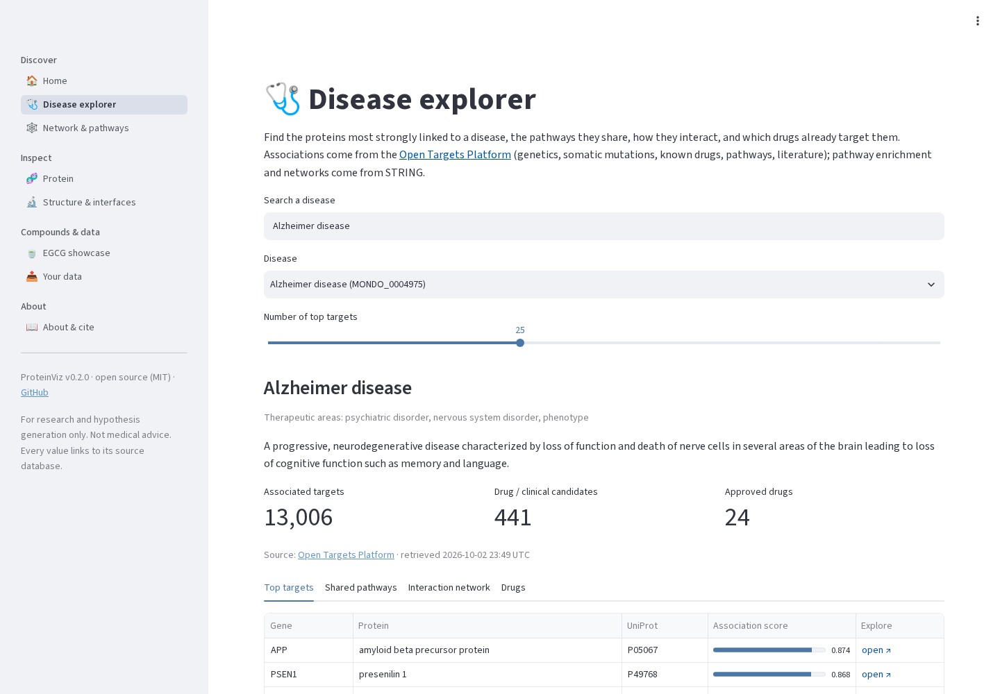
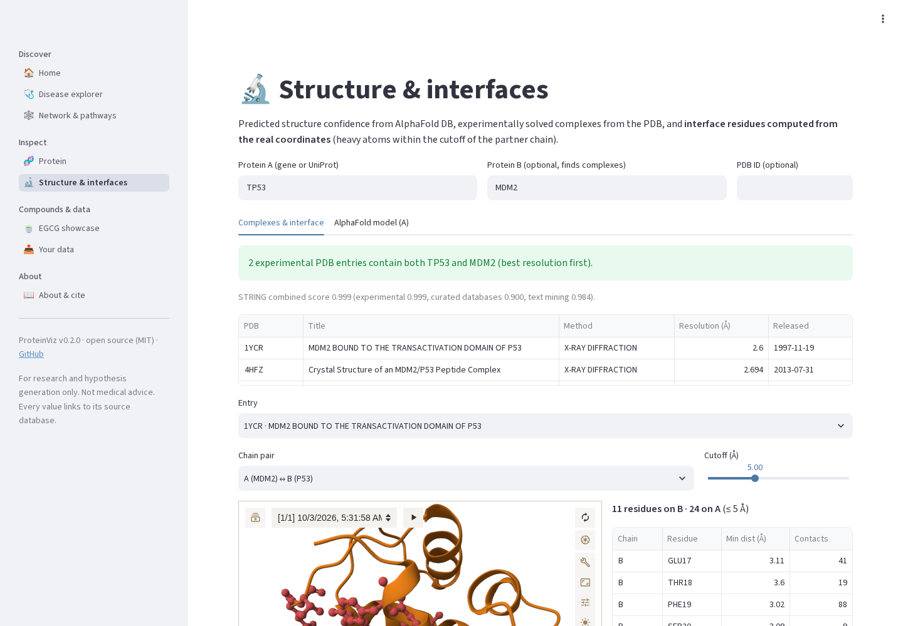
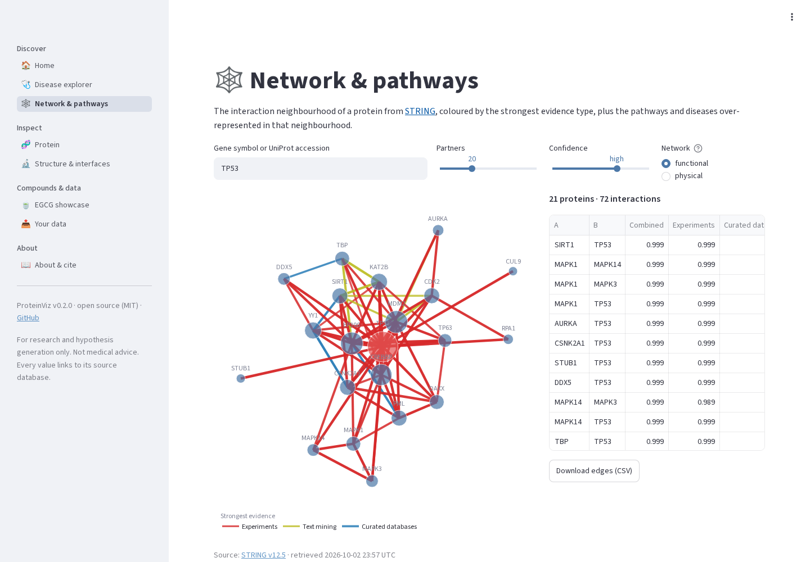

<div align="center">

# 🧬 ProteinViz

**Explore disease pathways from genes to proteins, interactions, 3D structures and compounds, using only public data you can trace.**

[](https://github.com/shekibahmed/ProteinViz/actions/workflows/ci.yml)
[](pyproject.toml)
[](LICENSE)
[](DATA_LICENSES.md)
[](CITATION.cff)
[](https://proteinviz.streamlit.app)

</div>



ProteinViz helps researchers and the wider community start from **a disease** and find
the **proteins and pathways behind it**. You can then see **how those proteins interact**,
inspect **their 3D interfaces**, and check **which compounds and drugs already act on them**.
It is a free, open-source front-end to Open Targets, STRING, UniProt, the PDB, AlphaFold DB and
ChEMBL. **Every number links back to its source, and nothing is simulated.**

> **For research and hypothesis generation only.** Associations, enrichments and in-vitro
> activities are leads to test, not conclusions, and nothing here is medical advice.

## What you can do

| | Feature | Powered by |
|---|---|---|
| 🩺 | **Disease explorer:** top associated targets, shared KEGG/Reactome pathways, the interaction network among them, drugs by clinical stage, and highly associated targets with no drug yet | Open Targets · STRING |
| 🕸️ | **Network & pathways:** the STRING neighbourhood of any protein, coloured by evidence type, with pathway and disease enrichment (FDR-controlled) | STRING v12.5 |
| 🧬 | **Protein:** function, disease associations, Reactome pathways, domains, sequence properties | UniProt · Open Targets |
| 🔬 | **Structure & interfaces:** AlphaFold models coloured by pLDDT, a PAE heatmap, experimentally solved complexes of a protein pair, and **interface residues computed from real coordinates** in an interactive Mol\* viewer | AlphaFold DB · RCSB PDB · gemmi · Mol\* |
| 🍵 | **EGCG showcase:** green-tea catechin targets from ChEMBL ranked by evidence (with assay-interference caveats), then the pathways and diseases they point to. Follows on from a [published LC-MS/MS study of Assam tea](#related-research-paper) | ChEMBL · STRING |
| 📤 | **Your data:** paste a gene list or upload an interaction table and get the same pathway analysis | STRING |

Pages have **shareable permalinks**, e.g. `/structure?a=TP53&b=MDM2` or
`/disease?id=MONDO_0004975`, so you can put a view in a paper, a lab chat or a slide.

<table>
<tr>
<td></td>
<td></td>
</tr>
<tr>
<td align="center"><sub>p53–MDM2 (PDB 1YCR): interface residues computed from coordinates</sub></td>
<td align="center"><sub>TP53 STRING neighbourhood, coloured by strongest evidence channel</sub></td>
</tr>
</table>

## Try it online

**Live demo: <https://proteinviz.streamlit.app>.** It's free, with no sign-up. Try
[Alzheimer disease](https://proteinviz.streamlit.app/disease?id=MONDO_0004975&q=Alzheimer+disease) or the
[p53–MDM2 interface](https://proteinviz.streamlit.app/structure?a=TP53&b=MDM2).
The app sleeps when idle, so the first load can take about 30 s.

## Quick start

```bash
git clone https://github.com/shekibahmed/ProteinViz.git
cd ProteinViz
pip install -e .               # or: uv sync
proteinviz app                 # opens http://localhost:8501
```

There are no API keys, accounts or GPUs, and nothing costs money. All data sources are free public APIs, and
responses are cached on disk (set `PROTEINVIZ_CACHE_DIR` to choose where).

### Use it from Python

The core library has no UI dependency, so you can use it in notebooks and pipelines:

```python
from proteinviz.sources import opentargets, string_db, rcsb
from proteinviz.structure.interface import compute_interface

ad = opentargets.disease_profile("MONDO_0004975")  # Alzheimer disease
genes = [t.symbol for t in ad.targets]
pathways = string_db.enrichment(genes).by_category("KEGG", "RCTM")

ids, _ = rcsb.search_entries("P04637", "Q00987")  # p53 + MDM2 complexes
iface = compute_interface(rcsb.download_mmcif(ids[0]), "A", "B", pdb_id=ids[0])
print([f"{r.residue_name}{r.residue_number}" for r in iface.residues_b])
# ['GLU17', 'THR18', 'PHE19', 'SER20', 'LEU22', 'TRP23', 'LEU25', 'LEU26', ...]
```

Every result is a typed [pydantic](https://docs.pydantic.dev) model with a `provenance` field
(source, URL, version, retrieval time).

## Why another tool?

The STRING website, Open Targets, the RCSB viewer and PDBsum are excellent, but each answers one
question. ProteinViz **chains them into a single workflow**: disease → targets → pathways →
network → structure → interface → compounds. It also keeps provenance across the whole chain and
is open source, so you can script, extend or self-host it.

## Principles

1. **No fabricated output.** If a source fails or has no record, you are told so. Earlier
   prototype versions of this repo contained simulated predictions; v0.2 removed all of them
   (see [CHANGELOG](CHANGELOG.md)).
2. **Provenance everywhere:** source, link, release and retrieval time are shown for each result.
3. **Honest caveats** where the science needs them: knowledge bias in networks, crystal contacts
   versus biological interfaces, and assay interference by polyphenols.

## Roadmap

- [x] **v0.2, honest relaunch:** live data only, disease explorer, Mol\* interfaces, evidence-tiered EGCG dataset, offline-reproducible tests
- [ ] **v0.3, honest PPI prediction:** ESM-2 embeddings plus a classifier on the leakage-free Bernett et al. (2024) benchmark, with baselines and a model card
- [ ] **v0.4:** PyPI release, an MCP server so AI assistants can query ProteinViz, Colab notebooks
- [ ] **v1.0:** AlphaFold Server / Boltz-2 complex import, a precomputed EGCG co-folding gallery, a JOSS submission

Ideas and requests: [open an issue](https://github.com/shekibahmed/ProteinViz/issues). Biologists'
feedback is especially welcome.

## Development

```bash
uv sync --extra dev
uv run pytest                  # offline, uses recorded API responses in tests/fixtures/http
PROTEINVIZ_LIVE=1 uv run pytest   # against the live APIs
uv run ruff check . && uv run ruff format --check .
```

To refresh the EGCG dataset from the current ChEMBL release, run `python scripts/build_egcg_dataset.py`.
See [CONTRIBUTING.md](CONTRIBUTING.md).

## Related research paper

The EGCG showcase follows on from a peer-reviewed study co-authored by ProteinViz's author:

> Pulimamidi SS, Naik DD, Yadav M, Suryawanshi KG, Marathe SS, Jorvekar SB, Ponneganti S,
> **Ahmed S**, Hazarika A, Borkar RM. **Seasonal dynamics of phytometabolites content in Assam tea,
> *Camellia sinensis* var. *assamica* by LC-MS/MS: Implications for quality.**
> *Journal of Food Composition and Analysis* 2024; 134: 106546. ISSN 0889-1575.
> <https://doi.org/10.1016/j.jfca.2024.106546>
> ([ScienceDirect](https://www.sciencedirect.com/science/article/pii/S0889157524005805))

**What the study did.** It followed how the phytometabolite content of Assam tea
(*Camellia sinensis* var. *assamica*, the main tea variety of Northeast India) changes with the
season. Buds and dormant leaves (*banjhi*) were harvested in the monsoon, autumn and winter, and
an LC-MS/MS method was developed and validated to quantify the metabolites. The aim was to help
growers choose harvest times.

**What it found.** Epigallocatechin gallate (EGCG) was the most abundant catechin, and its level
depended strongly on the harvest season:

| Metabolite | Sample | Monsoon (µg/mg) | Later season (µg/mg) |
|---|---|---|---|
| EGCG | Bud | 78.01 ± 13.31 to 125.21 ± 5.65 | 17.86 ± 1.22 to 51.11 ± 1.21 (winter) |
| EGCG | Banjhi leaf | 203.86 ± 21.06 to 312.58 ± 28.23 | 74.43 ± 15.22 to 97.52 ± 8.47 (autumn) |
| Epicatechin gallate | Bud | 17.04 ± 2.57 to 24.78 ± 1.15 | 5.36 ± 0.39 to 11.16 ± 1.74 (winter) |
| Epicatechin gallate | Banjhi leaf | 63.61 ± 1.60 to 72.72 ± 1.23 | 12.73 ± 2.07 to 15.35 ± 1.33 (autumn) |

Catechin hydrate, caffeine, gallic acid, theanine and theaflavin also varied by season. The
authors conclude that harvest timing matters for tea quality and for cultivation and processing
practices under a changing environment.

**How it relates to ProteinViz.** The paper measures *how much* EGCG and related metabolites the
tea plant contains. The [EGCG showcase](https://proteinviz.streamlit.app/egcg) asks the next
question: *which proteins and disease pathways* is EGCG reported to act on? The values above are
quoted from the paper's abstract. ProteinViz does not bundle or re-analyse the paper's data, and
the showcase's activity records come from ChEMBL.

<details>
<summary>BibTeX</summary>

```bibtex
@article{pulimamidi2024seasonal,
  title   = {Seasonal dynamics of phytometabolites content in {Assam} tea, {\textit{Camellia sinensis}} var. \textit{assamica} by {LC-MS/MS}: Implications for quality},
  author  = {Pulimamidi, Sai Sharanya and Naik, Dhanavath Dattu and Yadav, Mukul and Suryawanshi, Ketan G. and Marathe, Siddhi S. and Jorvekar, Sachin B. and Ponneganti, Srikanth and Ahmed, Shekib and Hazarika, Abhijeet and Borkar, Roshan M.},
  journal = {Journal of Food Composition and Analysis},
  volume  = {134},
  pages   = {106546},
  year    = {2024},
  issn    = {0889-1575},
  doi     = {10.1016/j.jfca.2024.106546},
  url     = {https://www.sciencedirect.com/science/article/pii/S0889157524005805}
}
```

</details>

## Citing

If you use the EGCG showcase, please also cite the paper above.
If ProteinViz helps your work, please cite it (see [CITATION.cff](CITATION.cff)) **and** the
resources it builds on: Open Targets, STRING, UniProt, RCSB PDB, AlphaFold DB, ChEMBL and Mol\*.
See [DATA_LICENSES.md](DATA_LICENSES.md) for licences and references.

## Acknowledgements and AI use

ProteinViz exists because of the teams who maintain these open resources. Development used AI
coding assistants under human direction; see [AI_USAGE.md](AI_USAGE.md).

Code: [MIT](LICENSE). Bundled EGCG data: CC BY-SA 3.0 (derived from ChEMBL).
